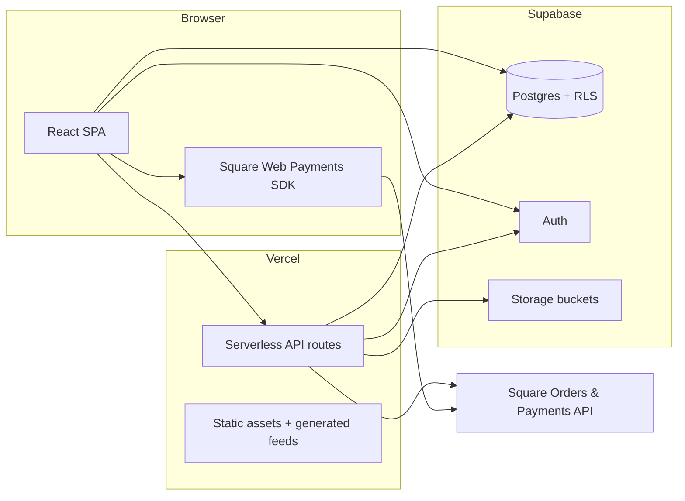

# Slept On Vintage

**Live site:** [sleptonvintage.com](https://sleptonvintage.com)

Full-stack e-commerce for my vintage clothing business — designed, built, and operated end-to-end as a CS student. The storefront, checkout, inventory admin, and marketing automation all run in production on real orders.

---

## About this project

I started with a static HTML/CSS prototype (`sleptonvintage-vanilla/`) to nail layout and category UX, then rebuilt the production app in **React + TypeScript** with a real backend: **Supabase** (Postgres, Auth, Storage, RLS) and **Square** for payments. Everything deploys on **Vercel** (SPA + serverless API routes).

This repo is meant to show how I think as a software engineer: product ownership, full-stack implementation, payments correctness, SEO/discovery, and operational tooling I actually use day-to-day to run the shop.

---

## Highlights (for reviewers)

| Area | What I implemented |
|------|-------------------|
| **Product & UX** | Custom UI/UX (not a template store); category browsing, search, product detail galleries, responsive layout, legal pages (terms, privacy, contact). |
| **Payments** | Square Web Payments SDK on the client; server-side order creation + payment capture via Vercel functions; idempotent payment keys; automatic refund path if inventory races at checkout. |
| **Orders & data** | Postgres schema with `orders` / `order_items`, money stored in **cents**, RLS so customers only see their orders; `finalize_order()` RPC for atomic inventory + order writes. |
| **Auth & cart** | Supabase Auth (email/password + Google); cart in DB when signed in, `localStorage` for guests, merge on sign-in; sold-item pruning so users cannot checkout stale inventory. |
| **Admin console** | Protected `/admin` dashboard: order fulfillment (status, carrier, tracking), product CRUD, multi-image gallery upload/reorder/rotate/crop, bulk “set primary image” from Storage. |
| **SEO & growth** | Per-route meta tags (Open Graph, Twitter, Pinterest product Rich Pins), JSON-LD `Product` schema, dynamic + build-time sitemaps with image extensions, `robots.txt`, Google Search Console + Pinterest domain verification. |
| **Automated feeds** | Build pipeline generates `sitemap.xml` and `pinterest-catalog.csv` from live inventory (Pinterest Catalogs URL ingestion, ~daily sync). |
| **Business rules** | Promo codes, $0 “free item” checkout path with server-validated totals and rolling-window abuse limits (Postgres RPC). |

---

## Architecture



**Request flow (paid checkout):**

1. Client loads cart and collects shipping info.
2. `POST /api/orders/create` — server validates cart against Supabase, applies promo logic, creates a **Square order** (source of truth for tax/total).
3. Square Web Payments **tokenizes** the card; `POST /api/payments/create` charges the Square order amount with an idempotency key tied to `orderId`.
4. Server calls `finalize_order()` to persist the order, snapshot line items, and mark products sold — with refund if inventory was lost in a race.

Free checkouts skip Square and use `POST /api/orders/finalize-free` with the same server-side total validation.

---

## Tech stack

| Layer | Technologies |
|-------|----------------|
| Frontend | React 19, TypeScript, Vite, React Router |
| Backend | Vercel serverless functions (`api/*`) |
| Database | Supabase (PostgreSQL), Row Level Security, SQL migrations in repo root |
| Auth | Supabase Auth (JWT), email allowlist for admin |
| Payments | Square Orders API + Payments API + Web Payments SDK |
| Media | Supabase Storage (product galleries, homepage video) |
| Analytics | Vercel Analytics |
| Tooling | Prisma (schema introspection), ESLint, PowerShell ops scripts |

---

## Admin & developer console

I built an internal admin area so I do not need the Supabase dashboard for daily shop work:

- **`/admin`** — Order table: fulfillment status, USPS tracking, buyer/shipping snapshot, promo codes, Square IDs; edit/delete with guardrails (delete does not auto-refund in Square).
- **`/admin/products`** — Inventory list and navigation to create/edit listings.
- **`/admin/products/new`** & **`/admin/products/:id`** — Listing editor with multi-image upload, gallery reorder, in-browser crop/rotate, and thumbnail sync to `products.image`.

Admin routes call a **single consolidated** `api/admin` handler (designed around Vercel Hobby serverless limits) with JWT verification against `ADMIN_EMAILS` and service-role Supabase access on the server only.

One-click **“Set primary images”** backfills `products.image` from the first file in each product’s Storage folder — useful after bulk uploads or migrations.

---

## SEO & automated discovery

- **`Seo` component** — Runtime updates to `title`, description, canonical URL, `robots`, Open Graph, Twitter Card, and Pinterest `product:*` tags on product pages.
- **`productSeo.ts`** — Listing-aware titles/descriptions/alt text (vintage keywords, category, size) plus **Schema.org `Product` JSON-LD**.
- **Sitemaps** — Generated at build time (`scripts/generate-sitemap.mjs`) and served dynamically at `/sitemap.xml` (`api/sitemap.ts`) with Google image sitemap entries.
- **Pinterest** — `scripts/generate-pinterest-catalog.mjs` → `/pinterest-catalog.csv` for catalog URL ingestion; Rich Pins via OG product metadata.
- **`public/robots.txt`** — Allows crawling of catalog pages; blocks `/admin`, `/checkout`, `/cart`, `/orders`, `/auth/`.

---

## Repository layout

```
sleptonvintage.com/
├── sleptonvintage-react/     # Production app (React + Vite + Vercel API)
│   ├── src/                  # Pages, components, contexts, services
│   ├── api/                  # orders, payments, admin, sitemap
│   ├── server/               # Shared server helpers (Square, admin auth, images)
│   ├── scripts/              # Sitemap + Pinterest catalog generators (run on build)
│   └── public/               # robots.txt, static assets, generated feeds
├── sleptonvintage-vanilla/   # Early static HTML/CSS prototype (archived reference)
├── supabase-*.sql            # Schema, orders, RLS, migrations (run in SQL Editor)
├── scripts/                  # Supabase restore / schema extract utilities
└── RUNBOOK.md                # Deploy, env vars, and common commands
```

---

## Local development

From the repo root (see **[RUNBOOK.md](./RUNBOOK.md)** for full commands):

```powershell
# Frontend only
cd sleptonvintage-react
npm install
npm run dev

# Frontend + API routes (Square checkout testing)
cd ..
vercel dev
```

**Build** (matches production — TypeScript compile, sitemap, Pinterest CSV, Vite bundle):

```powershell
cd sleptonvintage-react
npm run build
```

Environment variables are configured in Vercel (Supabase, Square, admin allowlist). Do not commit secrets.

---

## Database & migrations

SQL in the repo root documents the evolving schema:

- `supabase-manual-schema.sql` — Core `products` + storage setup
- `supabase-orders.sql` — Orders, line items, `finalize_order()`, RLS policies
- `supabase-free-item-limit.sql` — Rate limit RPC for $0 checkouts
- Additional migrations for cents-based pricing, primary images, storage prefixes, etc.

Restore/ops scripts live under `scripts/` (see RUNBOOK).

---

## Deployment

Production deploys from the repo root with Vercel’s root directory set to `sleptonvintage-react`:

```powershell
vercel --prod
```

---

## Contact

Business site: [sleptonvintage.com](https://sleptonvintage.com) · Contact page on the site for customer inquiries.

For engineering questions about this codebase, open an issue or reach out via the contact info on your GitHub profile / resume.
