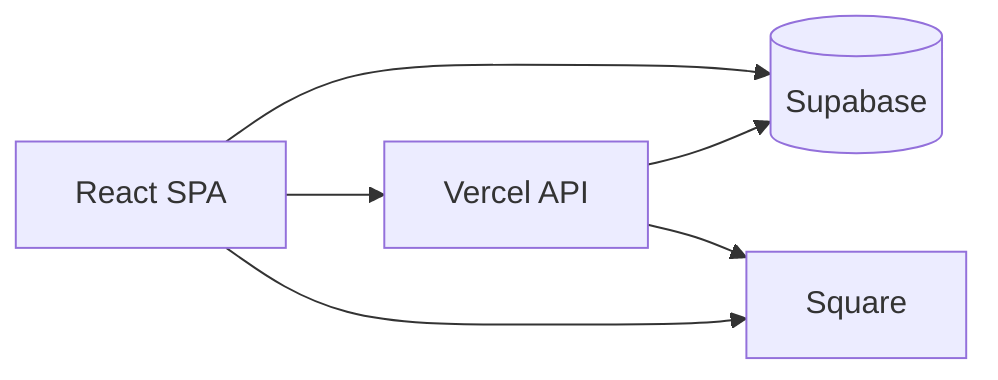

# Slept On Vintage

**Live:** [sleptonvintage.com](https://sleptonvintage.com)

Production vintage shop — React storefront, Supabase backend, Square checkout, Vercel hosting. Built and run end-to-end (not a template).

Early static prototype lives in `sleptonvintage-vanilla/`; everything customer-facing is in `sleptonvintage-react/`.

---

## Stack

| Layer | Tech |
|-------|------|
| Frontend | React 19, TypeScript, Vite, React Router |
| API | Vercel serverless (`sleptonvintage-react/api/`) |
| Data | Supabase (Postgres, Auth, Storage, RLS) |
| Payments | Square Orders + Payments + Web Payments SDK |
| Ops | Admin console, build-time sitemap + Pinterest CSV |

---

## Architecture



**Checkout:** Server creates a Square order → client tokenizes card → server captures payment → `finalize_order()` RPC writes the order and marks inventory sold (refund if stock races).

**Free orders:** Same validation path via `finalize-free`; promo + rolling-window limits in Postgres.

**Admin:** One `api/admin` handler (Hobby function limit); JWT + `ADMIN_EMAILS` allowlist; service role only on the server.

---

## Features

- **Storefront** — Categories, search, galleries, cart (guest `localStorage` + DB merge on sign-in), Google sign-in.
- **Orders** — Cents in DB, RLS per user, fulfillment fields in admin.
- **Admin** — Products (upload, reorder, crop, rotate), orders (status, tracking), bulk primary-image backfill.
- **Giveaways** — `/giveaway`: timed wheel draw, Google entry, public countdown, live resolve at `ends_at` (no reload), 7s reveal spin + confetti, 24h replay window. Winner gets a $0 order + shipping modal **after** the spin. One active giveaway at a time; listing hidden from catalog while running.
- **SEO** — `Seo` component, JSON-LD, dynamic/build sitemaps, Pinterest catalog CSV, Rich Pins.

---

## Giveaways (technical)

| Piece | Detail |
|-------|--------|
| **SQL** | `giveaways`, `giveaway_entries`, `products_public` view, `active_giveaway_public` view, `resolve_giveaway()` RPC |
| **Resolve** | Random entrant in Postgres after `ends_at`; marks product sold; real winner → `orders` status `giveaway` |
| **Test entrants** | `is_test` rows (no auth user); admin seed on create (up to 90); test winners skip shippable order |
| **Wheel** | `spin-wheel` canvas; idle spin until end; font scales with entrant count |
| **Admin** | Create/cancel on product edit; on `/giveaway`: remove entrant, cancel giveaway (pre-resolve) |
| **Migrations** | Run in order: `supabase-giveaways.sql` → `supabase-giveaway-winner-shipping.sql` → `supabase-giveaway-test-entries.sql` → `supabase-giveaway-replay-view-fix.sql` (keeps resolved giveaways visible 24h for replay) |

---

## Repo layout

```
sleptonvintage.com/
├── sleptonvintage-react/   # Production app (src, api, server, scripts)
├── sleptonvintage-vanilla/ # Static prototype (reference)
├── supabase-*.sql          # Schema migrations (Supabase SQL Editor)
├── scripts/                # Restore / schema utilities
└── RUNBOOK.md              # Env vars, deploy, commands
```

---

## Develop & deploy

```powershell
cd sleptonvintage-react
npm install
npm run dev          # UI only

cd ..
vercel dev           # UI + /api (checkout, admin, giveaways)

cd sleptonvintage-react
npm run build        # tsc + sitemap + Pinterest CSV + Vite
vercel --prod        # from repo root; Vercel root dir = sleptonvintage-react
```

Secrets live in Vercel only — see **RUNBOOK.md**.

**Core SQL (non-giveaway):** `supabase-manual-schema.sql`, `supabase-orders.sql`, `supabase-free-item-limit.sql`, plus price-cents / storage-prefix / primary-image migrations as needed.

---

## Contact

Shop: [sleptonvintage.com](https://sleptonvintage.com). Code questions: GitHub issues or profile on resume.
